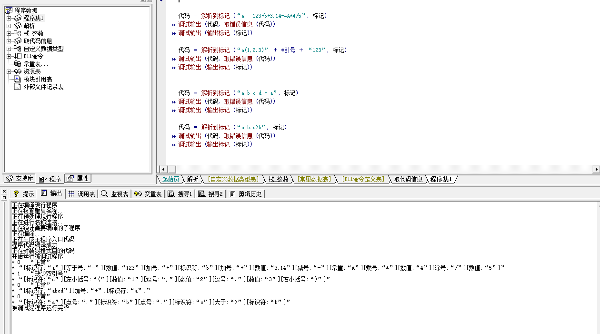

| 名 | 用过的编程语言 |  相关作品 |
| ------------- | ------------- | -------------
zj1d | e php js java | [vscode 中文快速输入插件](https://www.52pojie.cn/thread-1127596-1-1.html)
黄巍 | python, c++, js, CoffeeScript | [簡明強大的 Galgame、Visual Novel 引擎](https://github.com/RimoChan/Librian)
剑客 | javascript python | [JS 中文命名实践](https://www.bilibili.com/video/av79791491)
→小威← | |  中文命名实践: [c++](https://github.com/cflw/cflw_cpp), [python](https://github.com/cflw/cflw_py); [网络设备脚本](https://github.com/cflw/network_device_script), [东方山寨](https://github.com/cflw/dfsz)
chinesebear | c js | [中文 DSL](https://github.com/chinesebear/loongscript/blob/dev/spec/spec.md)
老吴 | Python, C | [草蟒编程语言](https://gitee.com/laowu2019_admin/grasspy380)
【匿名】新手 | EPL/C++/C#/JAVA | [易转C++编译项目主创](http://bbs.eyuyan.com/read.php?tid=413589)
StephenZhang	| python | [公众号爬虫](https://zhuanlan.zhihu.com/p/62000663)；[python控制Excel](https://zhuanlan.zhihu.com/p/54847656)
陆志广 | | [中文lisp编程语言](https://github.com/zhlisp/zhlisp)
韦茂成 | 易语言 | 易实现带鼠标截屏：
小枫叶 | python | [Python 中文命名实践](分享代码/谷歌翻译.py)
百度@CAD~第八个专家 | | [让CLANG支持GB系列编码、WIN下UNICODE编码的方法.md](分享代码/让CLANG支持GB系列编码、WIN下UNICODE编码的方法.md)
改变不了 | 易语言 | [C 中文命名实践——操作系统原型](https://github.com/q312102408/---/tree/master/%E9%9B%B6)
些似 | 易语言 | 易实现词法解析：
htwx | | [CTS, klang 等](https://gitee.com/HTWX)
Exception | java php c c++ 易语言etc... | [支持中文关键字的脚本语言](https://github.com/alextsao1999/hypermind/blob/f4b33724ae02fa57e4df33daffedc90417ca52c8/src/lexer.h#L144)
buyouyuan | | [修改ICC42](截图/修改ICC_buyouyuan.png)使之[支持中文关键字](分享代码/测试_buyouyuan.c)
飞天御剑流 | c delphi | [修改tinycc](截图/修改tinycc_飞天御剑流.png)使之[支持中文关键字](分享代码/修改tinycc_例程_飞天御剑流.png)
The Sixth Epoch | C# js python 易语言 | [多语言辅助开发VUE框架前端模板](https://github.com/mandolin/hia-multilingual-vue-template)
我心忆旧| | [C++ 中文命名实践](分享代码/例程_我心忆旧.cpp)
小程 | python vb | [Python 中文命名实践](分享代码/小程_分解质因数.py)
（QQ 末尾6283） | Haskell,Clojure,Racket,Idris,易语言,e4a | [支持中文语法的编程语言](https://gitlab.com/the-language/the-language/-/blob/master/core/bootstrap-library/src/Y)
SwizL | | 修改编译器添加中文关键字：[clang](https://zhuanlan.zhihu.com/p/31158537), [Python](https://zhuanlan.zhihu.com/p/31159526), [gcc](https://zhuanlan.zhihu.com/p/31376652), [OpenJDK](https://zhuanlan.zhihu.com/p/42442463), [go](https://zhuanlan.zhihu.com/p/106104002), [JS](https://zhuanlan.zhihu.com/p/44953946), [tinycc](https://github.com/program-in-chinese/tinycc_cn)([自举](https://github.com/program-in-chinese/tinycc_zh))
Seawind2012 | python | [利用草蟒汉化pygame类库](https://gitee.com/a439800108/grasspy380/tree/master/Lib/site-packages/%E6%B8%B8%E6%88%8F%E6%B4%BE)
猛将兄 | vb vc | 3/26 (已响应)
大苏打撒旦上          | Java  | 3/26 （已响应）
千里冰封 | Agda, Perl, Rust | 3/28（已响应）
Debug | 易语言 js lua脚本 | 3/28（已响应）
将军 | python 易语言 | 3/28（已响应）
梦开始的地方 | PHP, Java，按键精灵 | 3/29 (已响应，待研究中文命名不支持[问题](https://github.com/program-in-chinese/overview/issues/171))
马文军 [̲̅V̲̅I̲̅P̅]  | java、易语言 | 3/29
悠长假期 | | 3/29
ㅤㅤㅤ💟 | | 3/29
食人魔法师 | python，golang，c | 3/29
明日香妞妞 | python CSharp  | 3/29
虚幻 	| C++ | 3/29
✎﹏ Paul | 易语言，c，go,js,php | 3/29
YUI | | 3/29
落忧へ | ruby, php, js | 3/31 （已响应）
蓝凤凰 | Java | 4/1
深度学习 | | 4/1
Y | | 4/1
(7776) | | 4/1
--- | 下为未点过名的账号，多数已退出，待清理 | ----
5a2efa4e | Java
jоinтег | C++,Scheme,Python,Haskell,OCaml等
敢于亮剑 | java
慢读 | C
u.14 | python
鹦鹉螺 | 无，是准备学习编程的萌新
听说风很大 | C++ java
QQ | 易语言
四禾广告 | C语言 python
张涛 | php python js java
名字是啥 | python
转 | c
䮻 | 易语言，vc++
2019 | 习语言
伴读书僮 | Lua
红豆Say/se/qq | C#
迷失^掩盖寂寞、 | java c python
李小凤 | php，java,vb,c,python
神秘人 | python
冬青木 | java c c++ python
我心易用 | c/c++ 易语言
Apexel | Java/Python/Golang
兼爱非攻 | C#，java，目前在学html5 css3 javascript
/ | Python
冰霜之锤 | C C++ Java Kt JS
我在北方却是你的南方看你 | Python js
Lomachenko | c#,易,delphi
Moemod Hymei❄️ | 吸PP
云碧月                 18km | 易语言
冷青 | PHP  js  c# c
1768238533 | Erlang
bool | python,c#,js,c,node
銘℡ | 正在学
snowRiverFireworks | js。java
稚嫩。| node. js
天天向上🍃  | C
Z大叔💋  | php，python，java，js，c
桥非桥。路归路 |
Poisedloosir | python
海少 | js,C++,python
eval | c，php，go，py，java，js
Leslie | c++，py，transact-SQL
J O E♔ | Python在学  c#  php js
Curry | c
请月红 | 没用过程序证明系的
wdtt | C++ Python PHP MQL
律玉奈间 # sync failed | kotlin
みさか9982 | java。python。c。
寸木 | 易语言 快手 C#  Go PHP 等
镜::影 | Java，C#，js，ts
缘 | 易安卓
LVOVV	| 易
四月一日	|c,c++,csharp,python,js,ts
吴烜 | Java JS PHP Delphi Python Scheme C

